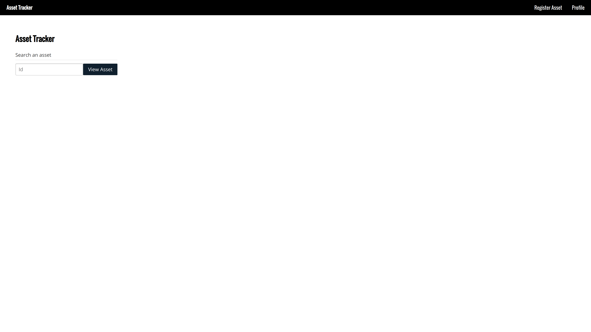
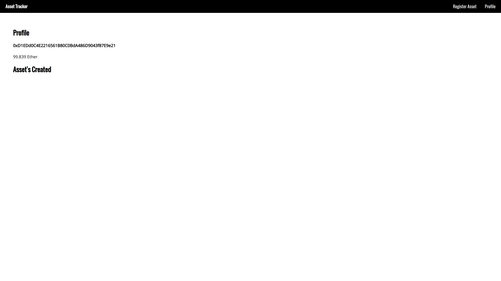
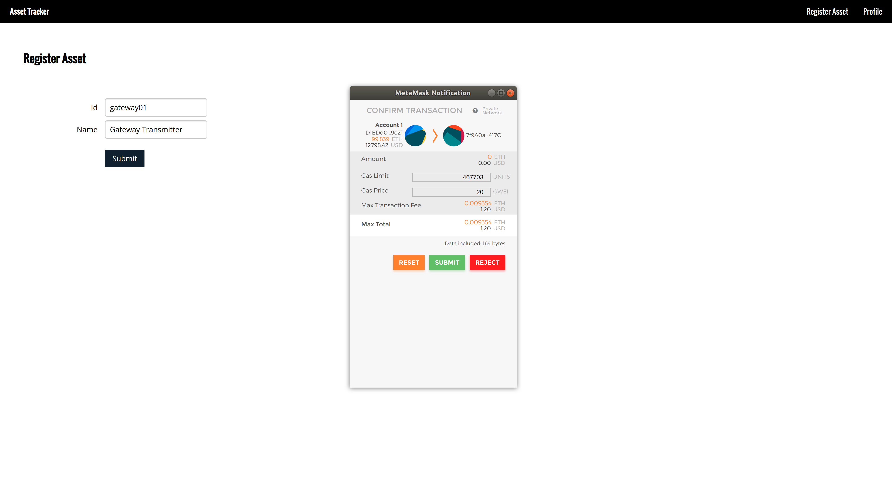
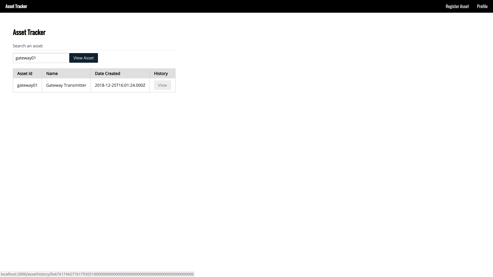
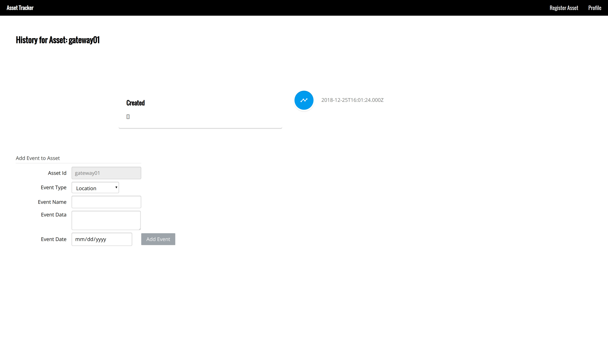
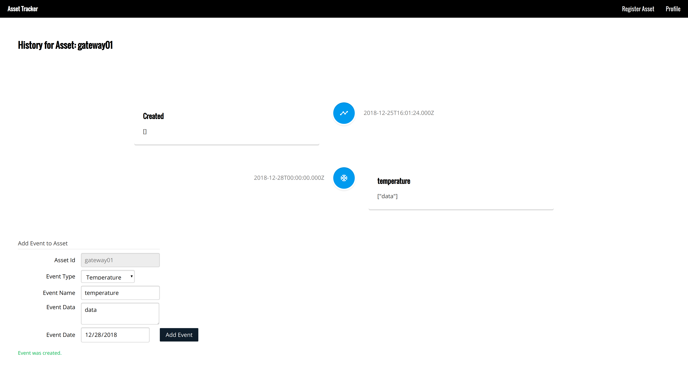

# Asset Tracker DApp

[](https://travis-ci.org/asebak/asset-tracker-dapp)


One of the best use cases for blockchain technology is combining IoT sensors and smart contracts to create immutability for  data integrity to make sure a supply chain is compliant with regulations, prevent tampering and counterfeits in products through full transparency using sensors to record this data on the blockchain.
Although the tampering and counterfeit aspects are more at the hardware level, blockchain technology allows the data from these sensors to be immutable allowing anyone to view the history of an asset being tracked to make sure they are fully compliant such as weather a certain product had the proper temperature, humidity levels, went through proper quality control processes or even the locations in the chain that it went to. 

### User Stories

1. As an owner of IoT devices, I would like to use sensor capabilities for tracking and tracing assets providing full transparency to end users on the data.

2. As a owner of a company, I would like to know how an asset was tracked within the whole supply chain process from points such as manufacturing, quality control and sensor readings in the chain to make sure the asset is within compliance regulations.

3. As an end user, I would like to verify that an asset that I had received has not been tampered with, counterfeited or has some irregularities with what I am expecting.

### Requirements
* Ubuntu 16.04+
* NodeJS 8+
* Truffle v4
* MetaMask Plugin
* Ganache CLI

### Building
```sh
$ npm install
$ ganache-cli &
$ truffle migrate
```

### Running Tests
```sh
$ truffle test
```

### Running Web App

```sh
$ npm start
```

### Rinkenby Testnet Address
https://rinkeby.etherscan.io/address/0xad053378589f890f1fa5b52bde25e8ad2f083f01

It's Located in docs/deployed_addresses.txt

### Deployment to a Rinkenby testnet 
1) Get an infura.io secret key and some ether for your account on the Rinkenby network
2) In truffle.js file edit mnemonic and apiKey with your details and then run the following command
```sh
$ truffle migrate --network rinkeby
```

### How to use the app

##### Main Page
Once the app is started you will see the app as below:



You can view an asset by an id, register an asset or view your profile.

##### View Profile Page
When you go to the view profile page, you will see your account details and all the assets you have registered.



##### Register Asset Page
The first thing to do in the App is to visit the register asset page.  You place any id and the name, such as the below example:



Once you click submit you will get a metamask confirmation box.  After confirming the metamask details and clicking submit there will be a message on the UI if it was successful or an error occurred.  If you are running a local instance it should return a confirmation message pretty quickly, on a testnet it might take sometime. 


##### View Asset
Going back to the main page or profile page you can view the asset created by entering the id of the asset.



Once you see the table details, you can click the view button under the History column to see the timeline of the asset.


##### View/Create Events Timeline
After clicking the view button of an asset, you can view the timeline history.



Initially a Create event is shown whenever a new asset is registered. 

You can add any new types of events from the below, an example is shown below adding a temperature reading.



This is the basic example of how the contract works.  In a real case scenario these functions would be executed both by users and devices depending on where they are located in the supply chain.
